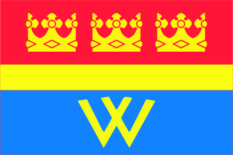
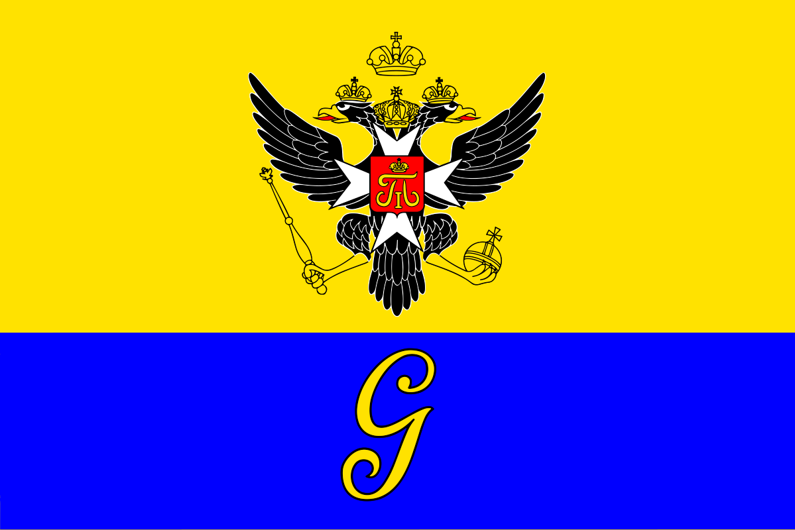
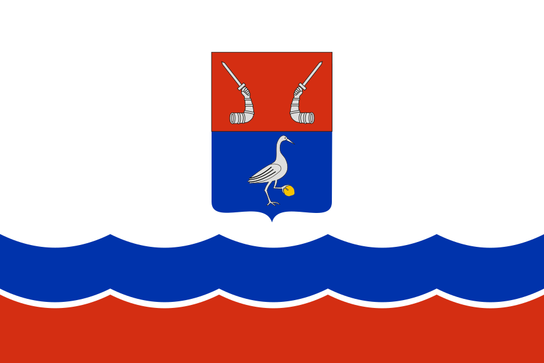
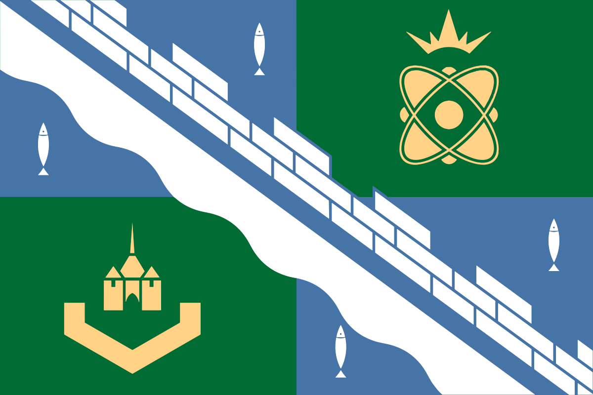

# @russian-flags/leningrad-oblast

[English version](./README.en.md)

Нативная ESM-коллекция SVG-флагов городов и населенных пунктов Ленинградской области. Пакет можно использовать как npm-зависимость в JavaScript/TypeScript-проекте или как подключаемый набор готовых SVG-файлов и ленивых загрузчиков.

## Превью

| Населенный пункт | Флаг | slug |
| --- | --- | --- |
| Выборг |  | `vyborg` |
| Гатчина |  | `gatchina` |
| Тихвин |  | `tihvin` |
| Приозерск |  | `priozersk` |
| Сосновый Бор |  | `sosnovyy-bor` |

## Возможности

- 72 локальных SVG-флага в составе пакета.
- ESM-сборка с TypeScript-типами.
- Ленивые загрузчики для каждого флага.
- Поиск флага по slug, коду или русскому названию.
- Прямой импорт SVG-файлов через `flags/<slug>` или `svg/<slug>`.
- Подходит для обычного JavaScript, TypeScript и современных сборщиков.

## Установка

```bash
npm install @russian-flags/leningrad-oblast
```

Для локальной проверки из папки проекта:

```bash
npm install .
```

## Быстрый старт

```js
import { loadFlag, settlements } from "@russian-flags/leningrad-oblast";

console.log(settlements[0]);
// { slug: "boksitogorsk", code: "BOKSITOGORSK", name: "Бокситогорск" }

const image = await loadFlag("vyborg", {
  alt: "Флаг Выборга",
  className: "flag",
});

document.body.append(image);
```

`loadFlag` - алиас для `loadFlagImage`. Функция лениво импортирует модуль нужного флага, создает `` и по умолчанию ставит `loading="lazy"` и `decoding="async"`.

## Подключение SVG напрямую

Если нужен только файл флага, можно импортировать SVG напрямую:

```js
import vyborgFlag from "@russian-flags/leningrad-oblast/flags/vyborg";
import vyborgSvg from "@russian-flags/leningrad-oblast/svg/vyborg";

console.log(vyborgFlag);
console.log(vyborgSvg);
```

Вариант с расширением тоже поддерживается:

```js
import vyborgFlag from "@russian-flags/leningrad-oblast/flags/vyborg.svg";
import vyborgSvg from "@russian-flags/leningrad-oblast/svg/vyborg.svg";
```

`flags/<slug>` и `svg/<slug>` указывают на один и тот же файл внутри пакета:

```text
dist/flags/<slug>.svg
```

После публикации пакет также можно использовать как источник SVG через npm CDN:

```html

```

## Поиск населенного пункта

В большинство функций можно передавать:

- slug: `"vyborg"`;
- код: `"VYBORG"`;
- русское название: `"Выборг"`.

```js
import {
  resolveSettlementSlug,
  settlementSlugs,
  settlements,
} from "@russian-flags/leningrad-oblast";

console.log(settlements.length); // 72
console.log(settlementSlugs.includes("vyborg")); // true

console.log(resolveSettlementSlug("VYBORG")); // "vyborg"
console.log(resolveSettlementSlug("Выборг")); // "vyborg"
console.log(resolveSettlementSlug("yanino_1")); // "yanino-1"
console.log(resolveSettlementSlug("unknown")); // undefined
```

Ввод нормализуется: пробелы по краям удаляются, регистр не важен, `ё` считается как `е`, пробелы и `_` заменяются на `-`.

## Ленивое отображение списка

```js
import { loadFlag, settlements } from "@russian-flags/leningrad-oblast";

for (const settlement of settlements) {
  const row = document.createElement("tr");
  row.dataset.slug = settlement.slug;
  row.textContent = settlement.name;
  document.querySelector("tbody").append(row);
}

const observer = new IntersectionObserver((entries) => {
  for (const entry of entries) {
    if (!entry.isIntersecting) continue;

    observer.unobserve(entry.target);

    loadFlag(entry.target.dataset.slug).then((image) => {
      entry.target.append(image);
    });
  }
});

document
  .querySelectorAll("tr[data-slug]")
  .forEach((row) => observer.observe(row));
```

## Preload

`preloadFlag` запускает загрузку модуля флага без ожидания результата. Это удобно на `hover`, `focus` или перед появлением строки во viewport.

```js
import { preloadFlag } from "@russian-flags/leningrad-oblast";

button.addEventListener("pointerenter", () => {
  preloadFlag("vyborg");
});
```

Неизвестные значения игнорируются и не выбрасывают ошибку.

## API

| Экспорт | Описание |
| --- | --- |
| `settlements` | Массив метаданных `{ slug, code, name }`. |
| `settlementSlugs` | Массив всех доступных slug. |
| `normalizeSettlementInput(input)` | Нормализует пользовательский ввод перед поиском. |
| `resolveSettlementSlug(input)` | Возвращает slug по slug, коду или названию. |
| `getFlagModuleLoader(input)` | Возвращает ленивый загрузчик модуля флага или `undefined`. |
| `loadFlagModule(input)` | Лениво импортирует модуль флага. Бросает ошибку для неизвестного значения. |
| `loadFlagImage(input, options)` | Загружает флаг и возвращает `HTMLImageElement`. |
| `loadFlag(input, options)` | Алиас для `loadFlagImage`. |
| `preloadFlag(input)` | Запускает загрузку модуля без ожидания результата. |
| `createFlagImage(src, defaultAlt, options)` | Создает и настраивает `` для SVG-флага. |

## Типы

Пакет поставляет `.d.ts` файлы и экспортирует основные типы:

```ts
import type {
  FlagImageOptions,
  FlagModule,
  SettlementInput,
  SettlementMeta,
  SettlementSlug,
} from "@russian-flags/leningrad-oblast";
```

`FlagImageOptions` поддерживает:

| Поле | Назначение |
| --- | --- |
| `alt` | Альтернативный текст изображения. |
| `decoding` | Значение свойства `HTMLImageElement.decoding`. |
| `loading` | Значение свойства `HTMLImageElement.loading`. |
| `className` | CSS-класс изображения. |
| `title` | Атрибут `title`. |
| `id` | Атрибут `id`. |
| `width`, `height` | Размеры изображения. |
| `style` | Inline-стили. |
| `dataset` | Значения для `data-*`. |
| `attributes` | Произвольные HTML-атрибуты. |

## Совместимость

Пакет рассчитан на современные ESM-проекты и браузерное окружение. Функции `loadFlag`, `loadFlagImage` и `createFlagImage` создают `HTMLImageElement`, поэтому для них нужен DOM.

Метаданные (`settlements`, `settlementSlugs`, `resolveSettlementSlug`) можно использовать отдельно, например для поиска, автокомплита или генерации списка доступных флагов.

## Демо

```bash
npm run serve:demo
```

Открыть:

```text
http://127.0.0.1:5173/examples/
```

## Разработка

```bash
npm install
npm run build
npm test
npm run typecheck
npm run pack:dry
```

Сборка устроена так:

1. `scripts/build-source.js` читает `src/settlements.ts`, проверяет `assets/<slug>/index.svg` и генерирует TypeScript-исходники.
2. `scripts/build.js` собирает JavaScript через `esbuild` и копирует SVG в `dist/flags/<slug>.svg`.
3. `tsc -p tsconfig.build.json` генерирует `.d.ts` файлы в `dist`.

Чтобы добавить новый населенный пункт, добавьте запись в `src/settlements.ts`, положите SVG в `assets/<slug>/index.svg` и запустите сборку.

## Репозиторий

- GitHub: <https://github.com/lKolabrodl/leningrad-oblast-flags>
- Issues: <https://github.com/lKolabrodl/leningrad-oblast-flags/issues>

## Лицензия

Код пакета распространяется по лицензии MIT. SVG-флаги не входят в MIT-лицензию кода и сохраняют свои исходные лицензии.
